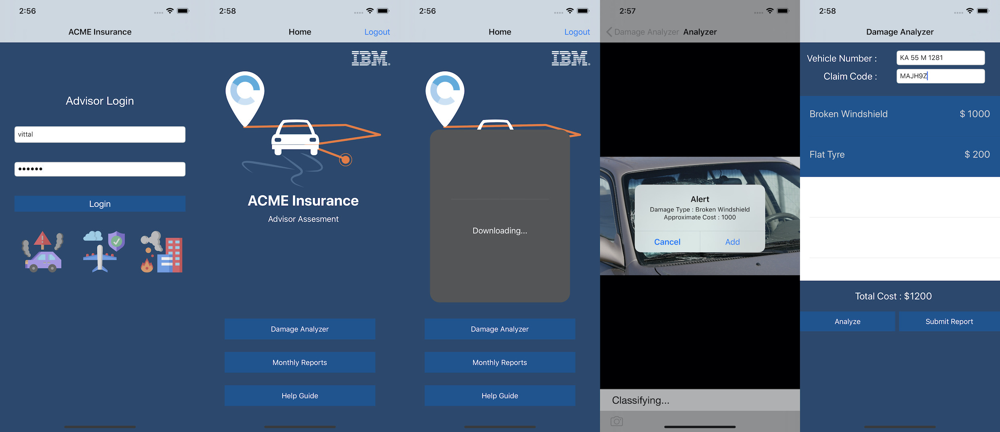
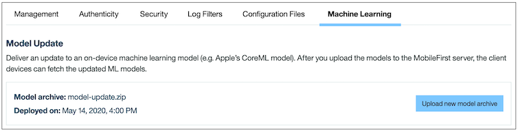

IBM MobileFirst Platform Foundation
===
## ModelUpdateSwift
iOS Swift sample which demostrates Machine Learning CoreML Model update feature using IBM MobileFirst Platform Foundation 

### Documentation
https://mobilefirstplatform.ibmcloud.com/tutorials/en/foundation/8.0/application-development/model-update/

### Usage

1. Use either Maven, MobileFirst CLI or your IDE of choice to [build and deploy the available `UserLogin` adapter](https://mobilefirstplatform.ibmcloud.com/tutorials/en/foundation/8.0/adapters/creating-adapters/.

    -  The UserLogin Security Check adapter can be found in https://github.com/MobileFirst-Platform-Developer-Center/SecurityCheckAdapters/tree/release80.

2. From a command-line window, navigate to the project's root folder and run the commands:
    - `pod update` followed by `pod install` - to add the MobileFirst SDK.
    - `mfpdev app register` - to register the application.

3. Add the sample images in iOS Simular or physical device. This is located in SampleData folder.

4. Run the application & login with credentials(vittal/vittal). Click on Damage Analyzer -> Analyzer -> Choose any one of the sample image. CoreML model fails to analyze the damage.

5. Now update the CorelML Model Update on Air using MobileFirst Console
    - Open the MobileFirst Operations Console and click the application entry in the left panel.
    - Navigate to Machine Learning tab and click Upload model archive 
    - Choose the `model-update.zip` file which is located inside ModelUpdatePackage folder and Click Ok to upload the packaged models.
    - 

6. Kill and Re-run the application, User can notice the model gets downloaded in the Home page.

7. Once the download is finished, Click on Damage Analyzer -> Analyzer -> Choose any one of the sample image. This time CoreML model will able to analyze the damage.

### Version
Swift 5.0

### Supported Levels
IBM MobileFirst Platform Foundation 8.0

### License
Copyright 2020 IBM Corp.

Licensed under the Apache License, Version 2.0 (the "License");
you may not use this file except in compliance with the License.
You may obtain a copy of the License at

http://www.apache.org/licenses/LICENSE-2.0

Unless required by applicable law or agreed to in writing, software
distributed under the License is distributed on an "AS IS" BASIS,
WITHOUT WARRANTIES OR CONDITIONS OF ANY KIND, either express or implied.
See the License for the specific language governing permissions and
limitations under the License.
